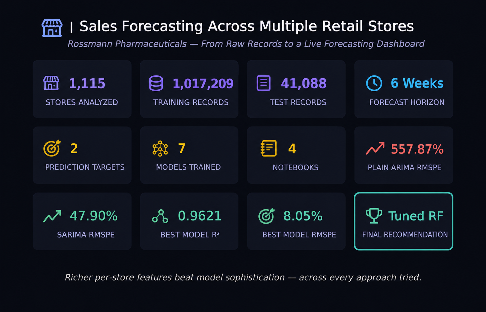

# 🏬 SALES FORECASTING ACROSS MULTIPLE RETAIL STORES
### *An End-to-End Forecasting Pipeline for Rossmann Pharmaceuticals' Retail Network*


---

### **From Raw Store Records to a Live Forecasting Dashboard**

An end-to-end sales forecasting pipeline built for Rossmann Pharmaceuticals, whose finance team needs to forecast daily sales across 1,115 stores up to six weeks ahead — replacing manager-by-manager guesswork with a single, validated, deployable system. The project spans exploratory analysis, a tuned tree-based model, two deep learning approaches (per-store and aggregate-series), classical time series forecasting, and a live Streamlit dashboard serving real-time Sales and Customer predictions.

Rather than treating each modeling approach as a separate exercise, this project builds them as one connected comparison: does a model with rich per-store features beat a sequence-aware deep learning model? Does a classical statistical model with an explicit seasonal term beat a small deep learning model asked to learn that pattern implicitly? Every notebook closes by answering these questions with real, validated numbers — not assumptions.

---

<p align="center">
  
</p>
<p align="center"><i>The project in twelve numbers — dataset scale, modeling scope, and the final verdict.</i></p>

---

> **⚠️ EVALUATION NOTICE:**
> Full findings, interpretations, and model comparisons are detailed throughout each notebook itself —
> every analytical section closes with an Interpretation block answering that section's own question,
> and each notebook closes with a Final Model Comparison and Executive Summary. A supplementary
> slide deck covering EDA highlights, model comparisons, and the live dashboard is also included in
> this repository for a condensed walkthrough.

---

## 🔴 Live Dashboard

**[rossmann-pharmaceuticals-sales-forecasting.streamlit.app](https://rossmann-pharmaceuticals-sales-forecasting.streamlit.app)**

Predicts both **Sales** and **Customer volume** for any store and date — single-store lookup with adjustable what-if inputs, or bulk CSV upload with an aggregate/per-store forecast view and CSV export.

> **Note:** the deployed app loads its models from Google Drive on first launch (~350MB combined). The very first prediction after the app wakes from idle may take 20–40 seconds while this downloads — every prediction after that is instant for the life of that session.

---

## 📌 Project Overview

Rossmann Pharmaceuticals' individual store managers currently forecast sales using personal judgement and experience — with no systematic model behind it. The data team identified promotions, competition, school and state holidays, seasonality, and store locality as the key drivers worth modeling formally.

This project answers one central question, from four independent angles:

> **Which modeling approach best forecasts daily store sales six weeks out — and does deep learning or classical time series modeling actually close the gap with a well-tuned tree-based model?**

---

## 🎯 Project Objectives

- Explore customer purchasing behavior — promotions, holidays, seasonality, competition — with full statistical rigor (outlier detection before treatment, evidence-based missing-value strategies).
- Build and tune a machine learning pipeline (Random Forest, benchmarked against XGBoost and LightGBM) to predict daily Sales, six weeks ahead.
- Build a sequence-aware deep learning model (LSTM, benchmarked against GRU) on the same per-store forecasting task, as a direct comparison point.
- Build classical time series models (ARIMA, SARIMA) and a univariate deep learning model on the aggregate network-wide series, to test whether per-store feature richness or sequence modeling matters more.
- Extend the pipeline to predict Customer volume alongside Sales, matching the dashboard's dual-output requirement.
- Serve both predictions through a live, deployed Streamlit dashboard usable by a non-technical store manager.

---

## ❓ Key Questions Answered

1. What drives sales — promotions, holidays, seasonality, store type, or competition — and how strong is each effect?
2. Can a tuned Random Forest reliably forecast six weeks ahead, and how does it compare to XGBoost/LightGBM?
3. Does an LSTM, given the same per-store features, outperform the tree-based model — or does tree-based modeling have a structural advantage on this kind of tabular, identifier-driven data?
4. Does classical time series modeling (ARIMA/SARIMA) on the network-wide aggregate series come close to per-store modeling — and does adding a seasonal term actually matter?
5. Given only the aggregate series (no store-level features at all), does a deep learning model or a classical statistical model perform better?
6. Which single model should actually power the production dashboard?

---

## 🚀 Project Pipeline at a Glance

| Component | Environment | Purpose | Key Output |
|---|---|---|---|
| **01_salesfc_preprocessing.ipynb** | Google Colab | EDA, data cleaning, feature engineering | `store_train_data.csv`, `store_test_data.csv` |
| **02_salesfc_ml_modeling.ipynb** | Google Colab | Random Forest (+ XGBoost/LightGBM comparison), Customers model | `final_tuned_rf_pipeline_*.pkl`, `final_tuned_rf_customers_pipeline_*.pkl` |
| **03_salesfc_deep_learning.ipynb** | Google Colab (GPU) | Per-store LSTM (+ GRU comparison) | `final_lstm_model_*.keras`, `checkpoints/gru_checkpoint.keras` |
| **04_salesfc_time_series.ipynb** | Google Colab | ARIMA, SARIMA, aggregate-series LSTM, full model comparison | `final_arima_model_*.pkl`, `final_sarima_model_*.pkl`, `final_aggregate_lstm_*.keras` |
| **salesfc_dashboard.py** | Local (VS Code) | Live prediction dashboard | Deployed Streamlit app |

Each notebook is designed to run standalone in Google Colab — see **Installation & Setup** below for the exact run order and why it matters.

---

## 📂 Dataset Overview

| Property | Detail |
|---|---|
| **Files** | `train.csv`, `test.csv`, `store.csv` |
| **Stores** | 1,115 |
| **Training Records** | 1,017,209 |
| **Test Records** | 41,088 |
| **Time Span** | ~3 years of historical daily sales (2013–2015) |
| **Forecast Horizon** | 6 weeks ahead |
| **Prediction Targets** | Sales (€) and Customers (count) |

---

## 🧹 Data Cleaning & Feature Engineering

Beyond standard cleaning, Notebook 1 resolved several genuine data issues rather than applying blanket fixes:

- **`DaysSinceLastHoliday` asymmetric missingness** — originally built per-dataset independently, causing train/test inconsistency; fixed by building the holiday calendar from the **combined** train+test date range.
- **Redundant `PromoInterval`** — dropped after being superseded by the engineered `IsPromo2Month` flag for historical rows.
- **`CompetitionOpenSinceMonth/Year`** — median-filled directly on raw calendar values (a deliberate, supervisor-confirmed decision, despite the "meaningless average month" caveat this introduces).
- **`Promo2SinceWeek/Year`** — converted to a duration feature (`Promo2_Duration_Weeks`) rather than raw-filled, since it's structurally tied to `Promo2 == 0` and needs no fill statistic.
- **Test-set `Open` (11 missing rows, all Store 622)** — filled as `1`, based on evidence from that store's confirmed Sunday-only closure pattern in its training history, not a default assumption.

---

## 📊 Notebook 1 — Exploration of Customer Purchasing Behavior

Full univariate → bivariate → multivariate EDA, closing with an EDA & Feature Engineering summary and the exported modeling-ready datasets.

**Key findings:**
- Sales and Customers are strongly correlated, but the relationship shifts materially under promotions — spend-per-customer rises, not just footfall.
- Store closures and reopenings around holidays show anticipation effects beyond the holiday day itself.
- StoreType and Assortment level both meaningfully shift baseline sales, independent of promotions.
- A recurring analytical caution surfaced twice: comparison groups that are a small, self-selected minority of stores confound the variable being tested with store selection itself — flagged explicitly wherever it applied, rather than reported as a clean effect.

---

## 🌲 Notebook 2 — Machine Learning Modeling

sklearn `Pipeline` architecture (ColumnTransformer: StandardScaler + OneHotEncoder + `Store` as an unscaled passthrough identifier), a time-based train/validation split (final 6 weeks — matching the forecast horizon), and RMSPE selected and defended as the primary loss function (not mandated by the brief, chosen for its direct, interpretable percentage-error framing).

**Key findings:**
- **Tuned Random Forest — R² = 0.9621, RMSPE = 8.05%, MAE = €389.83, RMSE = €594.54** — the strongest result in the entire project.
- A critical mid-notebook fix: an early version of the model included `Open` as a feature, trivially inflating performance since closed days always have `Sales = 0`. All reported results reflect the corrected, `Open`-excluded model.
- Top features by combined built-in + permutation importance: `CompetitionDistance`, `Store`, `Promo`, `Assortment`/`StoreType` (tied), `CompetitionOpen_Duration_Months`.
- A second Random Forest, reusing this same tuned architecture, was trained to predict **Customer volume** — **R² = 0.9467, RMSPE = 11.95%** — required for the dashboard's dual-output deliverable, not part of the Sales-model comparison above.

---

## 🧠 Notebook 3 — Deep Learning (Per-Store LSTM)

A sequence-aware deep learning approach, built as a direct comparison point to Notebook 2's tree-based models — same per-store features, same final-6-week validation split.

**Key findings:**
- Stationarity confirmed (ADF p = 0.000064), with ACF/PACF revealing a weekly-cycle-dominated autocorrelation structure, directly informing a 14-day sliding-window lookback.
- A real mid-project bug: `Store` — Notebook 2's #2 most important feature — was accidentally excluded from the LSTM's feature set. Once fixed, validation R² jumped from ~0.58 to ~0.83+.
- **2-layer LSTM — R² ≈ 0.836, RMSPE ≈ 19.45%** versus **2-layer GRU — R² ≈ 0.827, RMSPE ≈ 21.15%** — LSTM wins, but both trail the Random Forest by a wide margin.
- Error varies meaningfully by StoreType (11.28%–21.07% RMSPE) — the overall figure masks real reliability differences across the store network.
- GPU-accelerated training showed run-to-run non-determinism (a documented TensorFlow/cuDNN characteristic) even with a fixed seed — reported figures reflect a representative run within an observed stable range, stated explicitly rather than hidden.

---

## 📉 Notebook 4 — Classical Time Series & Aggregate Deep Learning

Where Notebooks 2 and 3 modeled *per-store* sales with rich features, this notebook asks a different question: working only from the **network-wide aggregate daily series** — no store-level features at all — how far can classical statistics or deep learning get?

**Key findings:**
- The aggregate series is stationary (identical ADF result to Notebook 3's own check, confirming consistency) with a strong, unambiguous weekly seasonal signature (significant ACF/PACF spikes clustered at multiples of 7).
- **Plain ARIMA(3,0,3) — R² = 0.2957, RMSPE = 557.87%** — converges cleanly but is structurally unable to represent the weekly cycle.
- **SARIMA(3,0,3)(1,0,1,7) — R² = 0.8558, RMSPE = 47.90%** — adding one seasonal term improves RMSPE more than tenfold, directly validating the seasonal hypothesis from the diagnostics stage.
- **A new, univariate Aggregate LSTM — R² = 0.9266, MAE = €651,332.88, RMSE = €822,374.17, RMSPE = 137.76%** — the strongest fit and lowest average error of the three aggregate models, but a weaker RMSPE than SARIMA, since RMSPE specifically penalizes the large *percentage* misses that occur on near-zero Sunday troughs.
- **Full project verdict:** the Tuned Random Forest remains the best model overall. Richer per-store input features mattered more than model sophistication, algorithm family, or sequence-modeling capability — a finding that held consistently across every approach tried.

---

## 🖥️ The Dashboard

A Streamlit app serving both trained Random Forest models (Sales and Customers) for live inference.

- **Single Store Prediction** — select a store, a forecast date, and adjust the top feature-importance drivers (Promo, Assortment, Store Type, Competition Distance) via synced slider + stepper controls; static store attributes auto-populate from `store.csv`.
- **Bulk CSV Upload** — upload a CSV (template provided in-app) covering multiple stores and dates; toggle between an aggregate network-wide view and a per-store view, both with a dual-axis Sales/Customers time series chart and a downloadable results CSV.
- Model details (architecture, R², RMSPE) are shown directly in the sidebar for transparency.

---

## 🗂️ Repository Structure

```text
NHIS_Project6/
│
├── Assets/                                  # DVC-tracked (data versioning); raw data and small
│   │                                        #trained artifacts are also force-added as plain git
│   │                                        #files so the repo is usable without a DVC pull
│   ├── train.csv, test.csv, store.csv       # Raw source data (plain git)
│   ├── store_train_data.csv                 # Notebook 1 output (DVC)
│   ├── store_test_data.csv                  # Notebook 1 output (DVC)
│   ├── final_lstm_model_*.keras             # Notebook 3 output (plain git — pre-trained)
│   ├── checkpoints/gru_checkpoint.keras     # Notebook 3 output (plain git — pre-trained)
│   ├── final_arima_model_*.pkl              # Notebook 4 output (plain git — pre-trained)
│   ├── final_sarima_model_*.pkl             # Notebook 4 output (plain git — pre-trained)
│   ├── final_aggregate_lstm_*.keras         # Notebook 4 output (plain git — pre-trained)
│   └── final_tuned_rf_pipeline_*.pkl,       # Notebook 2 output (DVC only — too large for git;
│       final_tuned_rf_customers_pipeline_*.pkl  #hosted on Google Drive for the dashboard)
│
├── deploy_assets/                           # Plain git; dashboard runtime folder
│   ├── store.csv                            # Static per-store attributes for the dashboard
│   └── logo.png                             # App icon / header logo
│
├── readme_assets/
│   └── hero_image.png                       # README hero image
│
├── .streamlit/config.toml                   # Dashboard theme configuration
│
├── 01_salesfc_preprocessing.ipynb
├── 02_salesfc_ml_modeling.ipynb
├── 03_salesfc_deep_learning.ipynb
├── 04_salesfc_time_series.ipynb
│
├── prerequisites.py                         # Shared utility module (all 4 notebooks)
├── salesfc_dashboard.py                     # Streamlit dashboard
│
├── requirements.txt                         # Slim — dashboard deployment only
├── requirements-full.txt                    # Complete — notebooks & local development
├── LICENSE
└── README.md
```

---

## 📦 Library Architecture

| Library | Purpose |
|---|---|
| **pandas / numpy** | Data manipulation and numerical computing |
| **matplotlib / seaborn** | Static data visualization |
| **scipy** | Statistical analysis |
| **scikit-learn** | Preprocessing pipelines, Random Forest, evaluation metrics |
| **xgboost / lightgbm** | Gradient boosting comparison models (Notebook 2) |
| **tensorflow** | LSTM/GRU deep learning models (Notebooks 3 & 4) |
| **statsmodels** | ARIMA/SARIMA time series modeling (Notebook 4) |
| **joblib** | Model serialization |
| **streamlit** | The live dashboard |
| **gdown** | Downloading large model artifacts from Google Drive at dashboard runtime |
| **dvc** | Data and artifact version tracking |

<details>
<summary><b>Exact pinned versions</b></summary>

**`requirements-full.txt`** (notebooks & local development):
```text
numpy==2.2.0
pandas==2.2.3
matplotlib==3.10.0
seaborn==0.13.2
scipy==1.15.0
scikit-learn==1.6.1
xgboost==2.1.4
lightgbm==4.5.0
tensorflow==2.20.0
statsmodels==0.14.4
joblib==1.4.2
jupyter==1.1.1
notebook==7.3.2
ipykernel==6.29.5
ipython==8.31.0
streamlit==1.41.1
dvc==3.59.0
gdown==5.2.0
```

**`requirements.txt`** (dashboard deployment — Streamlit Cloud):
```text
numpy==2.2.0
pandas==2.2.3
matplotlib==3.10.0
seaborn==0.13.2
scipy==1.15.0
scikit-learn==1.6.1
joblib==1.4.2
streamlit==1.41.1
gdown==5.2.0
```

</details>

---

## 💻 Installation & Setup

### Prerequisites

- A Google account (for Google Colab — all four notebooks run there)
- Python **3.10+** and a local terminal (for the dashboard only)

---

### Step 1 — Run the Notebooks (Google Colab)

**Run order matters.** Each notebook depends on the previous one's output existing on disk in the same session:

| Notebook | Requires | Produces |
|---|---|---|
| `01_salesfc_preprocessing.ipynb` | `train.csv`, `test.csv`, `store.csv` | `store_train_data.csv`, `store_test_data.csv` |
| `02_salesfc_ml_modeling.ipynb` | Notebook 1's two CSVs | Sales & Customers `.pkl` pipelines |
| `03_salesfc_deep_learning.ipynb` | Notebook 1's two CSVs | `final_lstm_model_*.keras`, GRU checkpoint |
| `04_salesfc_time_series.ipynb` | Notebook 1's two CSVs, Notebook 3's `.keras` (architecture reference only) | ARIMA/SARIMA `.pkl`, aggregate LSTM `.keras` |

1. Upload the notebook to Google Colab.
2. `prerequisites.py` auto-downloads itself from GitHub if not already present.
3. Data loads via a Local → Google Drive → GitHub raw fallback cascade — no manual setup needed if running against this repository.
4. Run sequentially, top to bottom.

**Pre-trained artifacts are already included in this repository** (see Repository Structure above) — except the two Random Forest pipelines, which retrain in Notebook 2 in a couple of minutes. This means Notebooks 3 and 4 do **not** need to be rerun from scratch to reproduce their reported results; the LSTM, GRU, ARIMA, SARIMA, and aggregate LSTM artifacts are pre-supplied specifically so evaluation doesn't require multi-hour retraining. Deleting them and rerunning top-to-bottom also works — just significantly slower.

---

### Step 2 — Run the Dashboard (Local, Required)

The dashboard cannot run in Colab — `streamlit run` needs a local server.

```bash
git clone https://github.com/S-Yousuf-S/NHIS_Project6.git
cd NHIS_Project6
python -m venv SalesFC_ENV
```

**Windows:** `SalesFC_ENV\Scripts\activate`
**macOS / Linux:** `source SalesFC_ENV/bin/activate`

```bash
pip install -r requirements.txt
streamlit run salesfc_dashboard.py
```

On first launch, the two Random Forest models (~350MB combined) download automatically from Google Drive into `deploy_assets/` and are cached for the rest of the session.

---

## 🙋 Frequently Asked Questions

**Q: Why was a planned MLflow tracking notebook dropped from the final deliverable?**

**A:** Per a supervisor decision, mid-project, in favor of Streamlit as the sole MLOps/serving deliverable rather than both. The notebook (`04_salesfc_mlflow_tracking.ipynb`) is kept in the repository as a record of the work — its real byproducts (Drive-mirrored model serialization, a Drive-mount detection bug fix, a reusable model-artifact loading cascade in `prerequisites.py`) carried forward into the rest of the project regardless.

**Q: Why does Notebook 4 exist separately from Notebook 3, when both use deep learning?**

**A:** They answer structurally different questions. Notebook 3's LSTM/GRU predict *per-store* sales using dozens of engineered features. Notebook 4's models — ARIMA, SARIMA, and a second, newly-trained LSTM — work from the *network-wide aggregate* series alone, with no store-level features at all. Comparing Notebook 3's per-store LSTM against ARIMA/SARIMA directly would not be a fair comparison; Notebook 4's aggregate LSTM exists specifically to make that comparison valid.

**Q: Why is Customer volume predicted by a separate model, not part of the original modeling notebooks?**

**A:** The original modeling brief focuses exclusively on Sales; Customers is only mentioned once, as a dashboard display requirement. Rather than leave that requirement unmet, a second Random Forest — reusing the Sales model's exact tuned architecture — was trained specifically to satisfy it. It is not part of the Sales-model comparison story in Notebooks 2–4.

**Q: SARIMA has a better RMSPE than the aggregate LSTM, but the LSTM has a better R² and MAE — which one is actually better?**

**A:** Neither, unconditionally — it depends on what the metric penalizes. R² and MAE reward overall fit and typical absolute accuracy, where the LSTM is stronger. RMSPE penalizes *percentage* error, which balloons on the aggregate series' near-zero Sunday troughs — exactly where SARIMA's explicit seasonal term gives it an edge. Both results are reported, not resolved into a single "winner," because the honest answer is metric-dependent.

**Q: Why does the dashboard download its models from Google Drive instead of loading them from the repository?**

**A:** The two Random Forest pipelines are each 300+MB — well over GitHub's 100MB file size limit even after compression. Rather than compromise the fully-tuned model's accuracy to fit a smaller size, they're hosted on Google Drive and downloaded once per app session via `gdown`, cached for the rest of that session.

**Q: Why does `Assets/` use DVC but also have plain git files inside it?**

**A:** DVC satisfies the project's data-versioning requirement for the derived, regenerable artifacts (processed CSVs, and the two large RF pipelines). Raw source data and the smaller pre-trained model artifacts are deliberately kept as plain git files instead, so a fresh clone of this repository is immediately usable — running the notebooks or the dashboard doesn't require a `dvc pull` step or access to the DVC remote.

**Q: Why does Random Forest outperform every deep learning and time series approach in this project?**

**A:** Retail sales forecasting leans heavily on discrete, high-signal categorical and identifier features — `Store`, `Promo`, `StoreType`, `CompetitionDistance` — which tree-based models split on natively and effectively. Every other approach in this project was either restricted to a less-informative feature set (the aggregate-series models) or had to learn store-identity effects implicitly through sequence modeling rather than being handed them directly. The consistent finding across all four notebooks is that feature richness mattered more than modeling sophistication.

---

## 📌 Conclusion

This project demonstrates a complete forecasting workflow — from raw store-level data through exploratory analysis, tree-based modeling, two forms of deep learning, and classical time series methods, closing with a deployed, live-serving dashboard. Four independent modeling approaches were built and honestly compared against one another, not just against a single baseline.

**Final verdict: the Tuned Random Forest is the best-performing model in this project** (R² = 0.9621, RMSPE = 8.05%), and the consistent lesson across every notebook is the same — richer, more specific input features beat model sophistication, every time they were tested against it.

---

## 🚀 Future Scope

- Resolve the RMSPE-vs-R² divergence between SARIMA and the aggregate LSTM with a metric better suited to near-zero-value series (e.g. MASE).
- Extend the dashboard's Customers model with its own dedicated feature-importance analysis, currently inherited unmodified from the Sales model.
- Multi-month rolling validation, rather than a single fixed final-6-weeks holdout, to test result stability across different seasonal windows.
- A lighter-weight, size-optimized deployment variant of the Random Forest pipelines, to remove the dashboard's Google Drive download dependency entirely.

---

# 👤 Author

**Yousuf S. R. Sakkaf**

**GitHub:** [https://github.com/S-Yousuf-S](https://github.com/S-Yousuf-S?tab=repositories)

---

⭐ *If you found this project helpful or insightful, consider giving the repository a star.*
